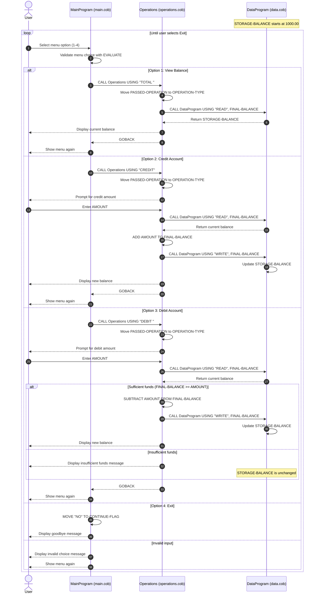

# COBOL Student Account Documentation

## Overview
This project implements a simple student account management flow in COBOL using three programs:
- `main.cob` for menu and control flow
- `operations.cob` for account operations
- `data.cob` for account balance storage/read-write access

The application supports viewing a balance, crediting funds, debiting funds, and exiting.

## File-by-File Purpose

### `src/cobol/main.cob`
**Program ID:** `MainProgram`

Purpose:
- Presents the account management menu
- Reads the user choice
- Routes requests to the operations module
- Repeats until the user selects Exit

Key logic:
- `PERFORM UNTIL CONTINUE-FLAG = 'NO'` main loop
- `EVALUATE USER-CHOICE` dispatch:
  - `1` -> `CALL 'Operations' USING 'TOTAL '`
  - `2` -> `CALL 'Operations' USING 'CREDIT'`
  - `3` -> `CALL 'Operations' USING 'DEBIT '`
  - `4` -> exits loop
  - `WHEN OTHER` -> invalid input message

### `src/cobol/operations.cob`
**Program ID:** `Operations`

Purpose:
- Implements balance inquiry, credit, and debit operations
- Coordinates with `DataProgram` for reading/writing balance

Key logic:
- Receives operation code in `PASSED-OPERATION` (`PIC X(6)`)
- Operation handling:
  - `TOTAL `:
    - Calls `DataProgram` with `READ`
    - Displays current balance
  - `CREDIT`:
    - Accepts user amount
    - Reads current balance
    - Adds amount
    - Writes updated balance
    - Displays new balance
  - `DEBIT `:
    - Accepts user amount
    - Reads current balance
    - If sufficient funds: subtracts and writes new balance
    - If insufficient funds: displays error and does not update balance

### `src/cobol/data.cob`
**Program ID:** `DataProgram`

Purpose:
- Encapsulates account balance state and exposes a small read/write interface

Key logic:
- Internal balance storage: `STORAGE-BALANCE PIC 9(6)V99 VALUE 1000.00`
- Receives operation code and balance variable via linkage
- Supported commands:
  - `READ` -> moves internal balance to caller
  - `WRITE` -> moves caller balance to internal storage

## Business Rules for Student Accounts

The following rules are implemented directly in code:

1. **Starting balance is 1000.00**
   - Initial balance is seeded in storage as `1000.00`.

2. **Only three account actions are supported**
   - View balance (`TOTAL `)
   - Credit account (`CREDIT`)
   - Debit account (`DEBIT `)

3. **Debit requires sufficient funds**
   - Debit proceeds only when `FINAL-BALANCE >= AMOUNT`.
   - If not, the program shows: `Insufficient funds for this debit.`
   - No balance update occurs on failed debit.

4. **Balance updates occur through the data module only**
   - `Operations` never updates persistent storage directly.
   - All persistence-style access goes through `DataProgram` using `READ` and `WRITE`.

5. **Operation codes are fixed-width (`PIC X(6)`)**
   - Codes such as `TOTAL ` and `DEBIT ` include a trailing space to fill 6 characters.

6. **Menu validation is enforced**
   - Inputs outside 1-4 are rejected with `Invalid choice, please select 1-4.`

## Notes and Constraints

- Amount entry is accepted directly into numeric fields (`PIC 9(6)V99`), so valid numeric input is assumed.
- This implementation models a single account balance value and does not include multi-student account IDs or records.

## Sequence Diagram (Data Flow)

